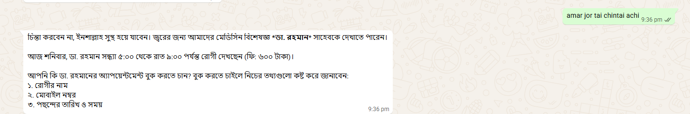
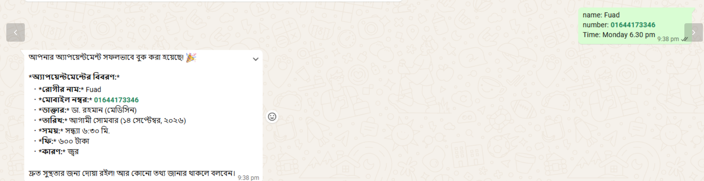
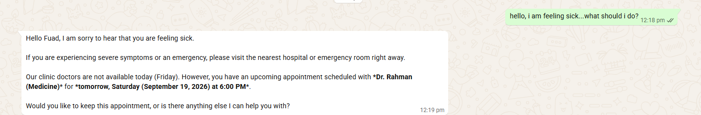
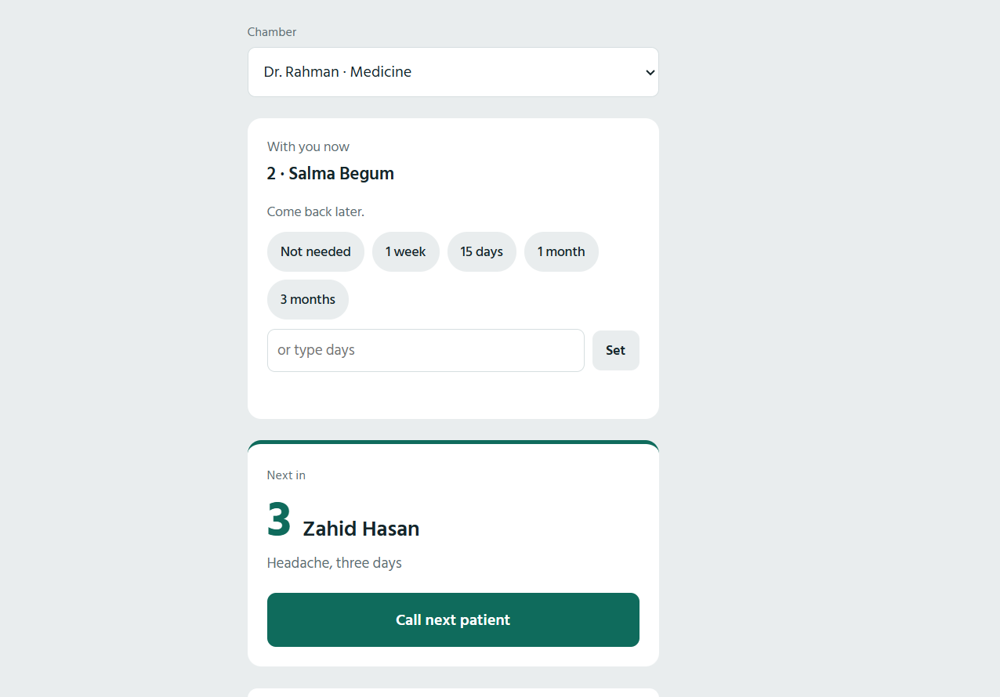
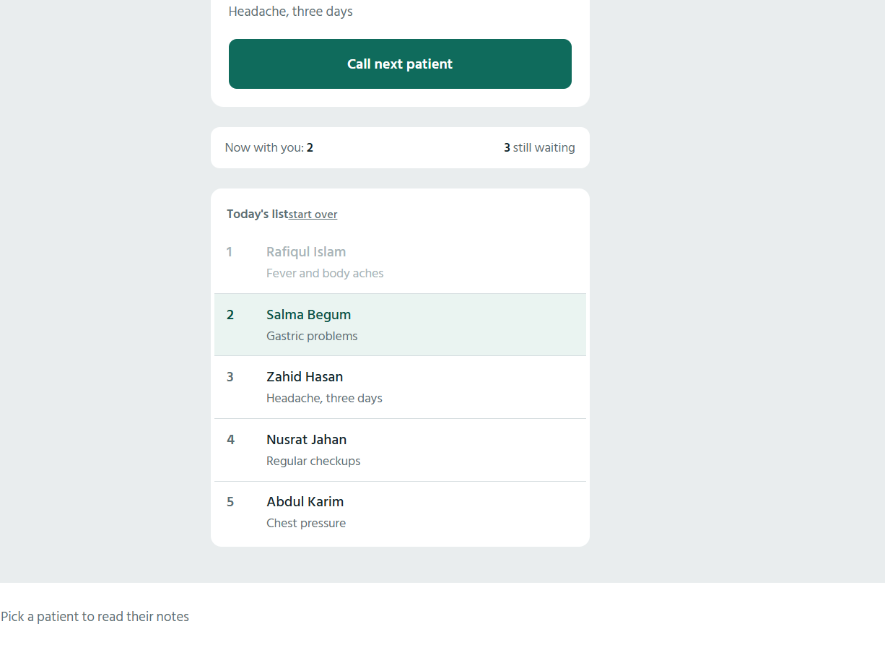
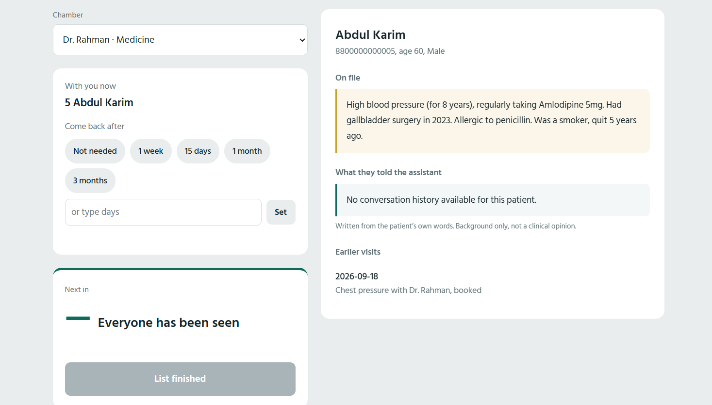
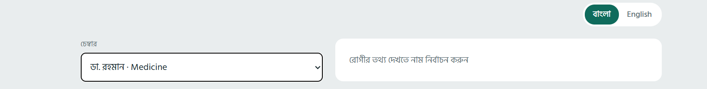
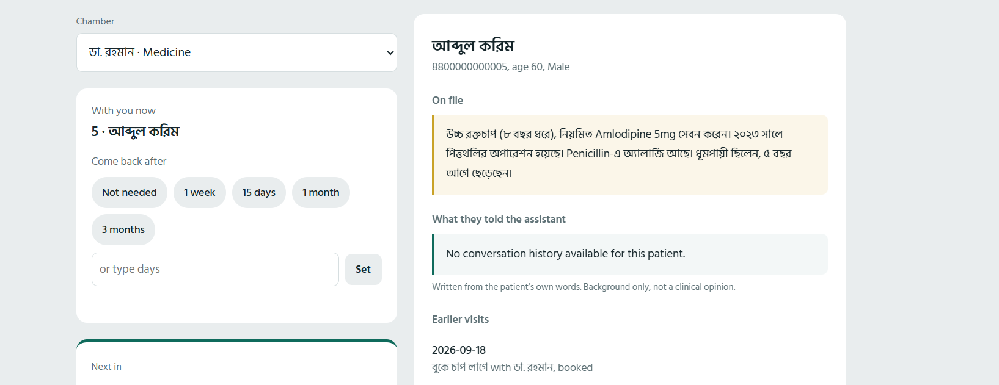

# Clinic AI Assistant

An autonomous WhatsApp receptionist for small clinics in Bangladesh. Patients message the
clinic in their own language and the assistant checks real doctor schedules, books
appointments, tells them how long the queue is, and reminds them when a follow-up visit is
due — with no human receptionist in the loop.

Built end to end: database, backend, AI reasoning layer, WhatsApp integration, a doctor-facing
web interface, and a scheduled job runner. Deployed and handling live WhatsApp conversations.

---

## The problem

In most small clinics here, one receptionist handles every phone call: which doctor sits on
which day, what the fee is, who gets which slot. Two things break because of it.

**Patients wait blindly.** You are told to come at 6 PM. The doctor runs late with an earlier
patient. You sit in the waiting room for two hours with no idea whether your turn is in ten
minutes or ninety, because nobody can tell you.

**Follow-ups quietly disappear.** The doctor says "come back in fifteen days." Nobody writes it
down anywhere the patient can see. Fifteen days pass. The patient forgets, or is not sure
whether it was fifteen days or a month, and does not come back.

Both problems are really the same problem: the information exists, but it never reaches the
patient. This project moves that information to where the patient already is — WhatsApp.

---

## What it does

**Books appointments through conversation.** A patient writes "amar jor hoyeche, kon doctor
dekhabo?" The assistant reads the actual doctor table, sees that the medicine specialist sits
Saturday, Monday and Wednesday from 5 to 9 PM, and offers real slots. It refuses to invent
availability — if the patient asks for a day the doctor does not sit, it says so and proposes
the next real one.

**Replies in the patient's own language.** Bangla, English, Banglish, or anything else — the
assistant mirrors whatever the patient wrote in, on every message.

**Remembers the conversation.** A patient can say "my stomach hurts", disappear for an hour,
come back and say "ok book it" — and the assistant still knows what they came for and which
doctor they picked. History is stored in Postgres, not in process memory, so it survives
restarts and redeploys.

**Answers "how much longer?"** Each booking gets a serial number. The doctor advances the
queue from their own page. When a waiting patient asks "koto number cholche", the assistant
tells them the serial being seen now, their own serial, how many people are ahead, and an
estimated wait — computed from how long the doctor is actually taking today, not a fixed
guess. Patients can leave home at the right time instead of sitting in the waiting room.

**Works in Bangla or English, on both sides.** Patients get replies in whatever language they
wrote in. The doctor's own page has a Bangla/English switch that changes every label on screen
and also changes the language the AI writes its patient summaries in — the choice is remembered
per device, so each person in the chamber sees it their way.

**Briefs the doctor before the patient walks in.** Tapping a patient on the queue page shows
their past visits and a short AI-written summary of what they told the assistant. The
summariser is constrained to report only what the patient said — no diagnosis, no suggested
tests, no invented detail — because a brief that speculates would anchor the doctor's thinking
before they have even seen the patient.

**Schedules follow-ups in the moment.** While the patient is still in the room, the doctor taps
"1 week" / "15 days" / "1 month" and presses next. A daily job then messages those patients on
the due date asking how they are and offering to book. Setting a follow-up is optional — the
doctor can simply press next.

---

## Screenshots

### Booking a visit in Bangla



The patient writes *"amar jor, tai chintai achi"* — I have a fever and I am worried. The
assistant reassures them, looks up the doctor table, and answers with what is actually there:
the medicine specialist Dr. Rahman, today's sitting hours of 5 to 9 PM, and the 600 taka fee.
It then asks for the three things it still needs before it can book — name, mobile number, and
preferred date and time.



The patient sends all three in one line. The assistant resolves "Monday" to a real calendar
date, books the appointment, and reads the details back: patient, number, doctor, date, time,
fee, and the reason it recorded from the start of the conversation. Nothing in that summary was
supplied twice — the complaint came from the first message, several turns earlier.

### The same assistant in English



Nothing is configured per language. The assistant replies in whatever language the patient
writes in, and everything else keeps working underneath: it checks that no doctor sits on a
Friday, then looks up this patient's record and reminds them they already have an appointment
booked for the next day rather than creating a duplicate. It also points anyone describing
severe symptoms towards a hospital instead of trying to handle it through a booking flow.

### The doctor's page

<p align="center">
  
  
</p>
<p align="center">
  
  
</p>
<p align="center">
  
</p>

One page runs the whole chamber, and it adapts to the screen it is opened on.

**The queue.** Every booking carries a serial number. The page leads with who walks in next
rather than the number currently being seen, because that is the thing the doctor cannot see
for themselves — the patient in front of them is already in the room. One button advances the
list; a strip underneath keeps the current serial and the number still waiting within reach.
Patients who have been seen fade out, and the person currently in the room is highlighted.

**The patient brief.** Tapping any name opens their record: standing notes kept by the clinic —
allergies, chronic conditions, past surgery — then a short AI-written summary of what the
patient told the assistant on WhatsApp, then their earlier visits. The standing notes sit above
the summary deliberately, because a penicillin allergy outranks anything said today. The
summary is constrained to report only what the patient actually said, and is labelled as
background rather than a clinical opinion.

**Follow-ups, set in the moment.** While the patient is still in the room the doctor taps
1 week, 15 days, 1 month, 3 months, or types any number of days, and then calls the next
patient. A daily job messages those patients on the due date. Setting one is optional — the
doctor can simply move on.

**Bangla or English.** The switch at the top changes every label on the page and also changes
the language the AI writes its patient summaries in. The choice is remembered per device.

---

## Architecture

```
   Patient's WhatsApp
           |
           v
   WhatsApp Cloud API  ---------------+
    (Meta)                            | template messages
           | webhook                  | (outside 24h window)
           v                          |
   +--------------------------------- + --------+
   |  FastAPI backend (Render)                  |
   |                                            |
   |    /webhook      incoming messages         |
   |    /doctor       queue + brief interface   |
   |    /tasks/...    scheduled jobs            |
   +------+-----------------------+-------------+
          |                       |
          v                       v
   Gemini (function calling)   Supabase / Postgres
   decides which tool to run   doctors, patients,
   from the patient's words    appointments, queue state,
                               conversation history
          ^
          | daily trigger
   cron-job.org
```

### Why it is shaped this way

**The AI does not touch the database directly.** Gemini is given six typed Python functions
and decides which to call from what the patient wrote. The functions themselves do the
querying. So the model chooses the intent; the code owns the data. A hallucinated schedule
cannot reach the patient, because the schedule never comes from the model.

**Conversation state lives in Postgres, not in RAM.** The first version kept chat sessions in a
dictionary. That works locally and fails the moment the host sleeps or redeploys, which on a
free tier is constant. Each turn now loads recent history from the database and writes both
sides back. Only the last 30 messages are loaded, so a patient with a year of history does not
make every reply slower and more expensive.

**Wait estimates use measured time, not configured time.** Every "next patient" press records a
finish and a start timestamp. Once there are at least two completed consultations that day, the
estimate switches from the doctor's configured average to what is actually happening in the
chamber. A doctor running long today produces longer estimates today.

**Everything behind /doctor is password-protected.** Those routes expose allergies, chronic
conditions and visit history, so they sit behind a sign-in that issues a signed, http-only
session cookie lasting one clinic day. The secret is never put in a URL, because URLs survive in
browser history, server logs and forwarded links. If the password or signing secret is missing
from the environment the routes return 503 rather than falling open, and repeated wrong
passwords from one address are throttled.

**Follow-up reminders go out as approved templates.** WhatsApp only allows free-form messages
within 24 hours of the patient's last message. A follow-up is weeks later, so the reminder is
sent as a pre-approved template; once the patient replies, the normal conversational flow takes
over again.

---

## Tech stack

| Layer | Choice |
|---|---|
| Language | Python 3.13 |
| API framework | FastAPI + Uvicorn |
| Database | Supabase (PostgreSQL) |
| AI | Google Gemini via `google-genai`, automatic function calling |
| Messaging | WhatsApp Cloud API (Meta) |
| Doctor interface | Server-rendered HTML, no build step |
| Hosting | Render |
| Scheduling | cron-job.org |

The doctor interface is deliberately plain HTML and CSS served from the backend. It is used for
a few seconds between patients on a phone; a frontend framework and build pipeline would have
added weight without adding anything the doctor would notice.

---

## Database schema

```
doctors                name, specialty, days, hours, fee, avg consultation minutes
patients               name, phone (unique), age, gender, notes
appointments           patient, doctor, date, time, serial number, status, reason,
                       arrived_at, started_at, finished_at,
                       follow_up_date, follow_up_sent
conversation_messages  session id (phone), role, content, timestamp
doctor_queue_state     doctor, date, current serial   (one row per doctor per day)
clinic_faq             question, answer
```

`doctor_queue_state` carries a unique constraint on (doctor, date) so a chamber can never end
up with two competing queues for the same day.

---

## The assistant's tools

Gemini is given these and picks between them on its own:

| Tool | Purpose |
|---|---|
| `get_all_doctors` | Who is available and in which specialty |
| `check_doctor_schedule` | Days, hours and fee for one doctor |
| `book_appointment` | Creates patient if new, assigns serial, books |
| `get_patient_appointments` | What the patient already has booked |
| `cancel_appointment` | Marks a booking cancelled (never deletes) |
| `check_queue_status` | Live serial, people ahead, estimated wait |

Cancellation sets a status rather than removing the row, so the clinic keeps a complete record
of what was booked and what was dropped.

---

## HTTP endpoints

| Endpoint | Purpose |
|---|---|
| `GET /` | Health check |
| `GET /privacy` | Privacy policy (required to publish the Meta app) |
| `GET /webhook` | Meta webhook verification |
| `POST /webhook` | Incoming WhatsApp messages |
| `POST /chat` | Same AI flow, for testing without WhatsApp |
| `POST /reset-chat` | Clears one conversation's history |
| `GET /doctor/login` | Sign-in form |
| `GET /doctor` | Queue and brief interface (requires sign-in) |
| `GET /doctor/queue/{id}` | Current serial and today's list |
| `POST /doctor/next/{id}` | Advance the queue |
| `POST /doctor/follow-up/{id}` | Set a return date for the patient in the room |
| `GET /doctor/patient-brief/{id}` | History and AI summary |
| `GET /doctor/logout` | Ends the session |
| `POST /tasks/send-follow-ups` | Daily reminder run (secret-protected) |
| `GET /tasks/follow-ups-due` | Who is due today, read only |

---

## Running it locally

```bash
python -m venv venv
venv\Scripts\activate          # macOS/Linux: source venv/bin/activate
pip install -r requirements.txt
uvicorn main:app --reload
```

Create a `.env` file in the project root:

```
GEMINI_API_KEY=
SUPABASE_URL=
SUPABASE_KEY=
WHATSAPP_TOKEN=
WHATSAPP_PHONE_NUMBER_ID=
WHATSAPP_VERIFY_TOKEN=
CRON_SECRET=

# the doctor page password, and a long random string used to sign the session
CLINIC_PASSWORD=
SESSION_SECRET=

# only needed by the two helper scripts
WHATSAPP_BUSINESS_ACCOUNT_ID=
TEST_RECIPIENT=
```

`subscribe_waba.py` links the business account to the app (run once per new token).
`test_send.py` fires a single message to `TEST_RECIPIENT` to confirm sending works.

To receive real WhatsApp messages while developing, expose the local server with a tunnel
(`ngrok http 8000`) and point the Meta webhook at `<tunnel-url>/webhook`.

On the Meta side you will need: an app with the WhatsApp product added, a permanent access
token issued to a system user, the `messages` webhook field subscribed, the business account
subscribed to the app, and the app switched to live mode.

---

## Known limits

- **Test numbers only.** The Meta test number reaches at most five pre-verified recipients.
  Serving real patients requires registering the clinic's own number and passing business
  verification.
- **Free-tier cold starts.** The host sleeps after fifteen idle minutes and takes roughly a
  minute to wake, which can drop the first message of a quiet period. A paid instance or a
  keep-alive ping removes this.
- **Appointment scheduling only.** The assistant never gives medical advice. Emergency triage is
  deliberately out of scope and would need clinical sign-off before being attempted.

---

## Roadmap

- Voice calls, so patients who do not type can use it — the original motivation for the
  project, and the largest remaining piece
- Emergency escalation, routing urgent symptoms to a human immediately instead of into the
  booking flow
- Prescription capture and medicine reminders
- Admin panel so clinic staff can edit doctors and schedules without touching the database
- Pilot with a real clinic, measuring wait times and no-show rates before and after